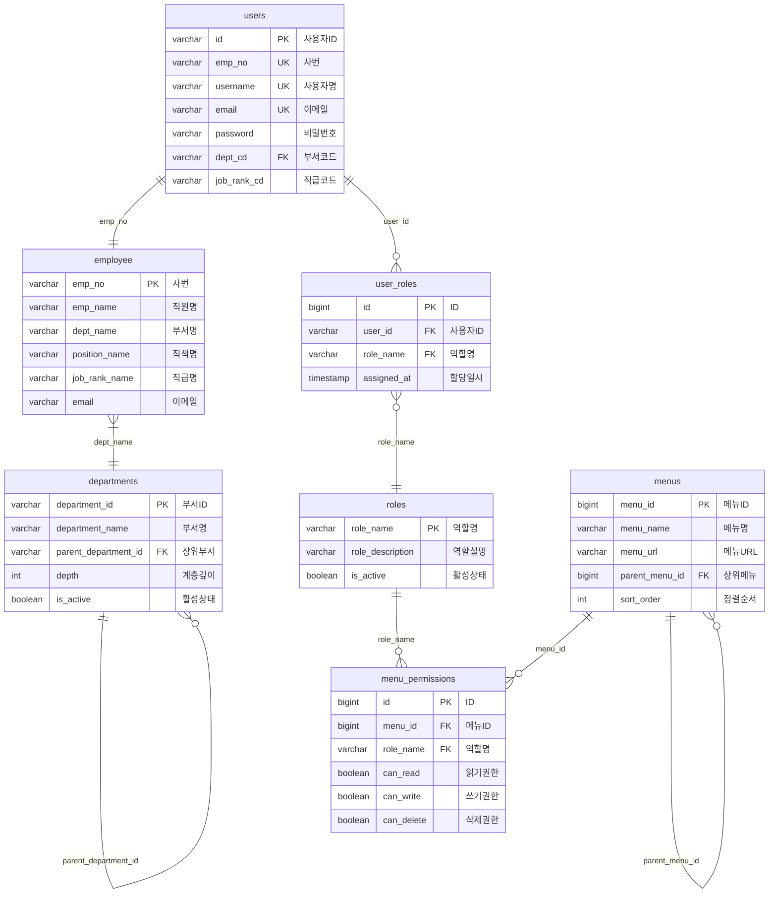
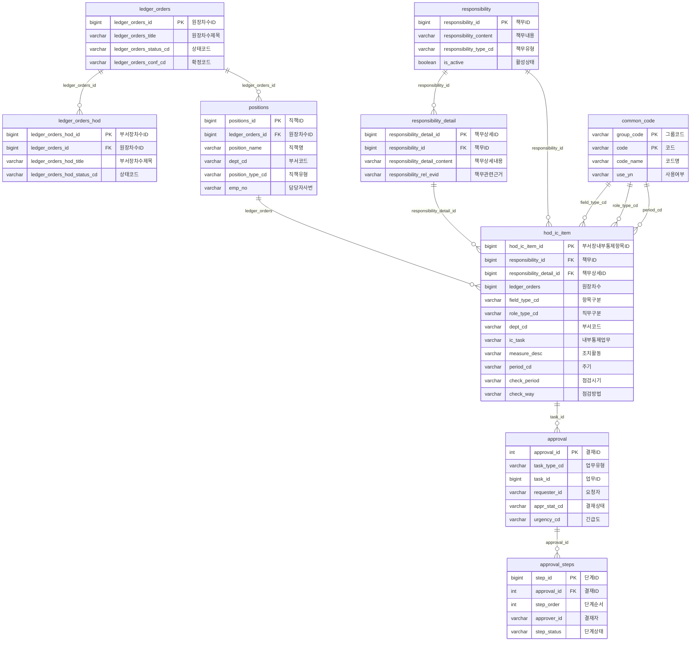
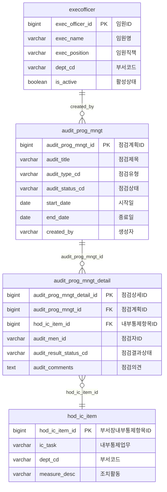
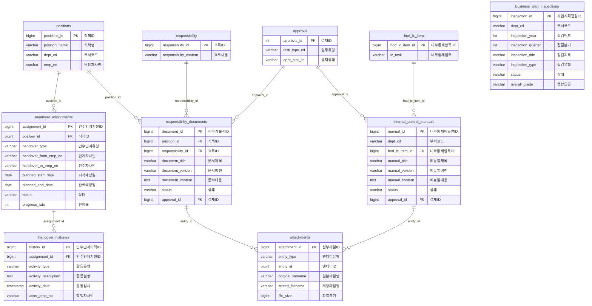

# 🗄️ ITCEN Solution - ER 다이어그램

ITCEN Solution 프로젝트의 데이터베이스 구조를 시각화한 ER 다이어그램입니다.

## 📋 목차

1. [전체 시스템 ER 다이어그램](#1-전체-시스템-er-다이어그램)
2. [도메인별 세부 ER 다이어그램](#2-도메인별-세부-er-다이어그램)
   - [사용자 & 권한 관리 도메인](#-사용자--권한-관리-도메인)
   - [원장 관리 & 결재 시스템](#-원장-관리--결재-시스템)
   - [점검 관리 시스템](#-점검-관리-시스템)
   - [인수인계 관리 시스템](#-인수인계-관리-시스템)
3. [ER 다이어그램 표기법](#3-er-다이어그램-표기법)

---

## 1. 전체 시스템 ER 다이어그램

### 📊 전체 시스템 관계도

```mermaid
erDiagram
    %% 사용자 및 권한 관리
    users ||--|| employee : has
    employee }|--|| departments : belongs_to
    users ||--o{ user_roles : assigned
    user_roles }o--|| roles : references
    roles ||--o{ menu_permissions : defines
    menus ||--o{ menu_permissions : protected_by
    menus ||--o{ menus : parent_child

    %% 원장 관리 시스템
    ledger_orders ||--o{ ledger_orders_hod : generates
    ledger_orders ||--o{ positions : contains
    positions ||--o{ hod_ic_item : manages
    responsibility ||--o{ responsibility_detail : detailed_by
    responsibility_detail ||--o{ hod_ic_item : referenced_by
    responsibility ||--o{ hod_ic_item : categorizes

    %% 결재 시스템
    approval ||--o{ approval_steps : consists_of
    approval ||--o{ hod_ic_item : approves
    approval ||--o{ responsibility_documents : approves
    approval ||--o{ internal_control_manuals : approves

    %% 점검 관리 시스템
    audit_prog_mngt ||--o{ audit_prog_mngt_detail : details
    audit_prog_mngt_detail }o--|| hod_ic_item : audits
    execofficer ||--o{ audit_prog_mngt : manages

    %% 인수인계 관리 시스템
    positions ||--o{ handover_assignments : requires
    handover_assignments ||--o{ handover_histories : tracked_by
    positions ||--o{ responsibility_documents : documented_by
    responsibility ||--o{ responsibility_documents : describes
    hod_ic_item ||--o{ internal_control_manuals : guided_by

    %% 첨부파일 시스템
    responsibility_documents ||--o{ attachments : attached
    internal_control_manuals ||--o{ attachments : attached

    %% 공통 코드 참조
    common_code ||--o{ hod_ic_item : codes_field_type
    common_code ||--o{ hod_ic_item : codes_role_type
    common_code ||--o{ hod_ic_item : codes_period
    common_code ||--o{ positions : codes_position_type
    common_code ||--o{ departments : codes_dept_type

    %% 테이블 정의
    users {
        varchar id PK
        varchar emp_no UK
        varchar username UK
        varchar email UK
        varchar dept_cd FK
        varchar password
        varchar job_rank_cd
        timestamp created_at
        timestamp updated_at
    }

    employee {
        varchar emp_no PK
        varchar emp_name
        varchar dept_name
        varchar position_name
        varchar job_rank_name
        varchar email
        varchar phone
    }

    departments {
        varchar department_id PK
        varchar department_name
        varchar parent_department_id FK
        int depth
        boolean is_active
        int sort_order
    }

    user_roles {
        bigint id PK
        varchar user_id FK
        varchar role_name FK
        timestamp assigned_at
        varchar assigned_by
    }

    roles {
        varchar role_name PK
        varchar role_description
        boolean is_active
    }

    menus {
        bigint menu_id PK
        varchar menu_name
        varchar menu_url
        bigint parent_menu_id FK
        int sort_order
        varchar icon_name
        boolean is_active
    }

    menu_permissions {
        bigint id PK
        bigint menu_id FK
        varchar role_name FK
        boolean can_read
        boolean can_write
        boolean can_delete
    }

    ledger_orders {
        bigint ledger_orders_id PK
        varchar ledger_orders_title
        varchar ledger_orders_status_cd
        varchar ledger_orders_conf_cd
        timestamp created_at
        timestamp updated_at
    }

    ledger_orders_hod {
        bigint ledger_orders_hod_id PK
        bigint ledger_orders_id FK
        varchar ledger_orders_hod_title
        varchar ledger_orders_hod_status_cd
        timestamp created_at
    }

    positions {
        bigint positions_id PK
        bigint ledger_orders_id FK
        varchar position_name
        varchar dept_cd
        varchar position_type_cd
        varchar status_cd
        varchar emp_no
        date start_date
        date end_date
    }

    responsibility {
        bigint responsibility_id PK
        varchar responsibility_content
        varchar responsibility_type_cd
        boolean is_active
        int sort_order
    }

    responsibility_detail {
        bigint responsibility_detail_id PK
        bigint responsibility_id FK
        varchar responsibility_detail_content
        varchar responsibility_rel_evid
        int sort_order
    }

    hod_ic_item {
        bigint hod_ic_item_id PK
        bigint responsibility_id FK
        bigint responsibility_detail_id FK
        bigint ledger_orders
        bigint ledger_orders_hod
        varchar field_type_cd
        varchar role_type_cd
        varchar dept_cd
        varchar ic_task
        varchar measure_desc
        varchar measure_type
        varchar period_cd
        varchar support_doc
        varchar check_period
        varchar check_way
    }

    approval {
        int approval_id PK
        varchar task_type_cd
        bigint task_id
        varchar requester_id
        varchar approver_id
        varchar appr_stat_cd
        timestamp request_datetime
        timestamp approval_datetime
        text comments
        varchar urgency_cd
    }

    approval_steps {
        bigint step_id PK
        int approval_id FK
        int step_order
        varchar approver_id
        varchar step_status
        timestamp step_datetime
        text step_comments
    }

    audit_prog_mngt {
        bigint audit_prog_mngt_id PK
        varchar audit_title
        varchar audit_type_cd
        varchar audit_status_cd
        date start_date
        date end_date
        varchar created_by
    }

    audit_prog_mngt_detail {
        bigint audit_prog_mngt_detail_id PK
        bigint audit_prog_mngt_id FK
        bigint hod_ic_item_id FK
        varchar audit_men_id
        varchar audit_result_status_cd
        text audit_comments
    }

    execofficer {
        bigint exec_officer_id PK
        varchar exec_name
        varchar exec_position
        varchar dept_cd
        boolean is_active
    }

    handover_assignments {
        bigint assignment_id PK
        bigint position_id FK
        varchar handover_type
        varchar handover_from_emp_no
        varchar handover_to_emp_no
        date planned_start_date
        date planned_end_date
        varchar status
        int progress_rate
    }

    handover_histories {
        bigint history_id PK
        bigint assignment_id FK
        varchar activity_type
        text activity_description
        timestamp activity_date
        varchar actor_emp_no
    }

    responsibility_documents {
        bigint document_id PK
        bigint position_id FK
        bigint responsibility_id FK
        varchar document_title
        varchar document_version
        text document_content
        varchar status
        bigint approval_id FK
    }

    internal_control_manuals {
        bigint manual_id PK
        varchar dept_cd
        bigint hod_ic_item_id FK
        varchar manual_title
        varchar manual_version
        text manual_content
        varchar status
        bigint approval_id FK
    }

    business_plan_inspections {
        bigint inspection_id PK
        varchar dept_cd
        int inspection_year
        int inspection_quarter
        varchar inspection_title
        varchar inspection_type
        varchar status
        varchar overall_grade
    }

    attachments {
        bigint attachment_id PK
        varchar entity_type
        bigint entity_id
        varchar original_filename
        varchar stored_filename
        varchar file_path
        bigint file_size
        varchar content_type
        timestamp upload_date
    }

    common_code {
        varchar group_code PK
        varchar code PK
        varchar code_name
        varchar code_description
        int sort_order
        varchar use_yn
        varchar parent_code
    }

    meta_datas {
        bigint meta_data_id PK
        varchar table_name
        varchar column_name
        varchar data_type
        varchar description
        varchar constraints
        boolean is_required
    }
```

---

## 2. 도메인별 세부 ER 다이어그램

### 🔐 사용자 & 권한 관리 도메인

이 도메인은 시스템의 사용자 인증, 인가, 메뉴 권한을 관리합니다.

**주요 특징:**
- 사용자(`users`)와 직원(`employee`)이 사번(`emp_no`)으로 연결
- 역할 기반 접근 제어(RBAC) 구현
- 계층형 메뉴 구조 지원
- 메뉴별 세분화된 권한 관리 (읽기/쓰기/삭제)

---

### 📊 원장 관리 & 결재 시스템

원장차수 관리, 직책 관리, 부서장 내부통제 항목 관리 및 결재 시스템입니다.

**주요 특징:**
- 원장차수 → 부서장차수 → 직책 → 내부통제항목의 계층 구조
- 범용 결재 시스템 (`task_type_cd` + `task_id`로 다양한 업무 연동)
- 다단계 결재 프로세스 지원
- 공통코드 시스템과 연동된 코드 관리

---

### 🔍 점검 관리 시스템

내부통제 항목에 대한 점검 계획, 점검자 지정, 점검 결과 관리 시스템입니다.

**주요 특징:**
- 점검 계획 → 점검 상세의 마스터-디테일 구조
- 내부통제항목별 점검자 지정 가능
- 점검 결과 상태 및 의견 관리
- 임원이 점검 계획을 생성하고 관리

---

### 📁 인수인계 관리 시스템

직책별 인수인계, 책무기술서, 내부통제 메뉴얼, 사업계획 점검을 관리하는 시스템입니다.

**주요 특징:**
- 직책 기반 인수인계 지정 및 이력 관리
- 책무기술서와 내부통제 메뉴얼의 문서 관리
- 결재 시스템과 통합된 승인 프로세스
- 범용 첨부파일 시스템 (`entity_type` + `entity_id`)
- 부서별 사업계획 점검 관리

---

## 3. ER 다이어그램 표기법

### 🔗 관계 표기법

| 표기법 | 의미 | 설명 |
|--------|------|------|
| `\|\|--o{` | 1:N 관계 (One-to-Many) | 하나의 부모가 여러 자식을 가질 수 있음 |
| `}o--\|\|` | N:1 관계 (Many-to-One) | 여러 자식이 하나의 부모를 참조 |
| `\|\|--\|\|` | 1:1 관계 (One-to-One) | 일대일 대응 관계 |
| `}o--o{` | N:M 관계 (Many-to-Many) | 다대다 관계 (중간 테이블 필요) |

### 🔑 컬럼 표기법

| 표기법 | 의미 | 설명 |
|--------|------|------|
| `PK` | Primary Key | 기본키 (고유 식별자) |
| `FK` | Foreign Key | 외래키 (다른 테이블 참조) |
| `UK` | Unique Key | 유일키 (중복 불가) |

### 📊 데이터 타입

| 타입 | 설명 | 예시 |
|------|------|------|
| `varchar(n)` | 가변 길이 문자열 | varchar(100) |
| `text` | 긴 텍스트 | 게시글 내용 |
| `bigint` | 큰 정수 | ID, 일련번호 |
| `int` | 정수 | 순서, 카운트 |
| `boolean` | 참/거짓 | 활성 상태 |
| `date` | 날짜 | 2024-01-01 |
| `timestamp` | 날짜+시간 | 2024-01-01 12:00:00 |

---

## 📈 시스템 특징

### ✨ 주요 강점

1. **확장 가능한 결재 시스템**
   - 범용 결재 테이블로 모든 업무 유형 지원
   - 다단계 결재 프로세스 구현
   - 긴급도, 상신취소, 반려 등 완전한 워크플로우

2. **모듈화된 도메인 구조**
   - 18개 독립적 백엔드 도메인
   - 12개 프론트엔드 도메인 모듈
   - 39개 데이터베이스 테이블

3. **통합된 권한 관리**
   - 역할 기반 접근 제어 (RBAC)
   - 메뉴별 세분화된 권한
   - 사용자-직원-부서 연동

4. **범용 첨부파일 시스템**
   - `entity_type` + `entity_id`로 모든 테이블 지원
   - 파일 메타데이터 관리
   - 업로드자 및 업로드 일시 추적

5. **감사 추적 (Audit Trail)**
   - 모든 테이블에 생성/수정 정보
   - 작업자 추적 가능
   - 데이터 변경 이력 관리

---

## 📚 관련 문서

- [프로젝트 README](./README.md)
- [CLAUDE.md - 프로젝트 가이드](./CLAUDE.md)
- [Backend API 문서](./backend-api-requirements.md)

---

*이 문서는 ITCEN Solution 프로젝트의 데이터베이스 구조를 이해하는 데 도움을 주기 위해 작성되었습니다.*
*최종 업데이트: 2025-01-14*